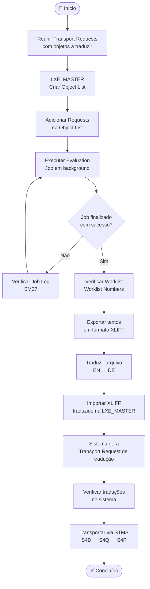

# SAP Mass Translation — LXE_MASTER

> **Guia de referência** para tradução em massa de objetos Z no SAP S/4HANA 2023 utilizando a transação `LXE_MASTER`.  
> Cobre o fluxo completo: extração → tradução → importação → transporte.

---

## Fluxo Geral



---

## Pré-requisitos

- Acesso à transação `LXE_MASTER`
- Transport Requests com os objetos Z já criadas e em status **modifiable** ou **released**
- Idioma de origem: **EN (English)**
- Idioma de destino: **DE (German)**

---

## Passo a Passo

### 1. Criar a Object List

**Transação:** `LXE_MASTER` → aba **Evaluations** → **Object Lists**

1. Clique em **New** para criar uma nova Object List
2. Informe um nome descritivo (ex: `TRAD_ALGARVE_2026`)
3. Na seção **Evaluate Transports**, adicione as Transport Requests desejadas
4. Marque a opção **Refresh Terminology Domains**
5. Salve

> 💡 Uma única Object List pode conter múltiplas requests — consolide todas aqui para traduzir tudo de uma vez.

---

### 2. Executar a Evaluation

**Transação:** `LXE_MASTER` → selecione a Object List → **Execute**

O sistema dispara um job em background (`OBJLIST_XXXXX`) que:
- Varre todas as requests informadas
- Identifica todos os textos traduzíveis (programas Z, formulários, customizing, etc.)
- Monta a Worklist com os itens encontrados

**Monitorar o job:**

```
SM37 → Job name: OBJLIST_* → User: <seu usuário>
```

Aguarde o status **Finished** antes de prosseguir.

**Tipos de objeto extraídos:**
- Textos de programas ABAP Z (títulos, mensagens, textos de seleção)
- Textos de Smartforms / Adobe Forms Z
- Descrições de customizing (configurações criadas)
- Textos de elementos de dados e domínios Z

---

### 3. Verificar a Worklist

**Transação:** `LXE_MASTER` → **Worklist Numbers**

Verifique:
- Quantidade de objetos encontrados
- Se todos os objetos esperados estão presentes
- Status de cada item (traduzido / pendente)

---

### 4. Exportar os Textos (XLIFF)

Na Worklist, exporte os textos para o formato **XLIFF**:

1. Selecione os itens desejados (ou todos)
2. Menu **Export** → selecione formato XLIFF
3. Salve o arquivo para envio ao tradutor

> O arquivo XLIFF contém os textos originais em EN prontos para preenchimento em DE.

---

### 5. Traduzir

Preencha as traduções EN → DE no arquivo XLIFF exportado.

Pode ser feito:
- **Manualmente** no próprio arquivo XML
- Via **ferramenta de tradução** (SDL Trados, memoQ, etc.)
- Diretamente na interface da LXE_MASTER pela aba **Translators**

---

### 6. Importar as Traduções

**Transação:** `LXE_MASTER` → **Worklist** → **Import**

1. Selecione o arquivo XLIFF com as traduções preenchidas
2. Execute a importação
3. O sistema aplica os textos DE nos objetos correspondentes

---

### 7. Coletar na Transport Request

Ao salvar as traduções importadas, o sistema solicita (ou gera automaticamente) uma **Transport Request de tradução**.

> ⚠️ Essa request é **independente** das requests originais dos objetos. Anote o número para transporte posterior.

---

### 8. Transportar via STMS

Ordem de transporte recomendada:

```
1. Requests originais dos objetos  →  S4D → S4Q → S4P
2. Request de tradução (LXE)       →  S4D → S4Q → S4P
```

> A request de tradução deve ser transportada **após** os objetos originais já estarem no ambiente de destino.

---

## Referência Rápida

| Etapa | Transação | Observação |
|---|---|---|
| Criar Object List | `LXE_MASTER` | Adicionar todas as requests |
| Monitorar Job | `SM37` | Job: `OBJLIST_*` |
| Exportar XLIFF | `LXE_MASTER` | Worklist → Export |
| Importar XLIFF | `LXE_MASTER` | Worklist → Import |
| Transportar | `STMS` | Objetos antes, tradução depois |

---

## Ambiente

| Sistema | Uso |
|---|---|
| S4D | Desenvolvimento — onde a tradução é executada |
| S4Q | Qualidade — validação das traduções |
| S4P | Produção — destino final |

**Versão SAP:** S/4HANA 2023 FPS04  
**Idioma origem:** EN  
**Idioma destino:** DE  

---

## Notas

- A Object List pode ser reutilizada para futuras execuções — basta atualizar as requests e rodar a evaluation novamente.
- Em caso de erros no job, verificar o **Job Log** em `SM37` → botão **Job Log**.
- Traduções parciais são possíveis: você pode importar por etapas e acumular na mesma request de tradução.
