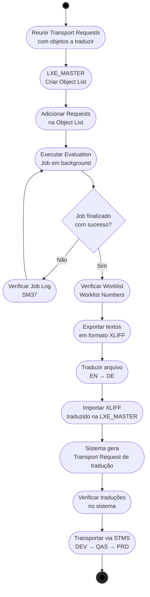

# SAP Mass Translation — LXE_MASTER

> **Guia de referência** para tradução em massa de objetos Z no SAP S/4HANA 2023 utilizando a transação `LXE_MASTER`.  
> Cobre o fluxo completo: extração → tradução → importação → transporte.

---

## 📋 Índice de Navegação

| Fase | Link | Descrição |
|------|------|----------|
| 1️⃣ Object List | [→ Criar Object List](#1-criar-a-object-list) | Setup inicial na LXE_MASTER |
| 2️⃣ Evaluation | [→ Executar Evaluation](#2-executar-a-evaluation) | Job em background para avaliar requests |
| 3️⃣ Worklist | [→ Verificar Worklist](#3-verificar-a-worklist) | Consultar itens identificados |
| 4️⃣ Exportar | [→ Exportar XLIFF](#4-exportar-os-textos-xliff) | Extrair textos em formato XLIFF |
| 5️⃣ Traduzir | [→ Traduzir](#5-traduzir) | Preencher traduções |
| 6️⃣ Importar | [→ Importar Traduções](#6-importar-as-traduções) | Aplicar traduções no sistema |
| 7️⃣ Transporte | [→ Transport Request](#7-coletar-na-transport-request) | Gerar TR de tradução |
| 8️⃣ STMS | [→ Transportar via STMS](#8-transportar-via-stms) | Promover para ambientes superiores |

---

## Fluxo Geral



---

## Configuração Inicial (Pré-requisito único por idioma)

Antes de rodar qualquer evaluation para um novo idioma alvo, é necessário configurar os **Object Types** e registrar o idioma. **Se essa configuração estiver ausente, a evaluation finalizará com sucesso mas a Worklist ficará vazia.**

### Registrar idioma alvo

**Transação:** `LXE_MASTER` → aba **Languages** → **Translation Languages**

Adicione o idioma alvo (ex: `deDE`) caso ainda não esteja listado. Os idiomas instalados ficam visíveis aqui com status **Installed**.

### Configurar Object Types para o idioma alvo

**Transação:** `LXE_MASTER` → aba **Languages** → **Object Types** → selecione o idioma alvo (ex: `deDE`)

Aqui você define quais tipos de objeto serão considerados na tradução para esse idioma.

**Para selecionar todos os Object Types de uma vez:**

Na tela de seleção existe uma árvore com grupos (ex: A5 User Interface Texts, B5 SAPScript, Q5 PDF-Based Forms, etc.). Selecione todos os grupos disponíveis e salve com um nome descritivo (ex: `object_types_all`) — isso garante que nenhum tipo de objeto seja excluído da avaliação.


**Object Types recomendados para tradução de objetos Z (programas e formulários):**

| Tipo | Descrição |
|---|---|
| `CA4` | Interface Texts (PROG) |
| `RPT4` | Text Elements (PROG) |
| `SRT4` | Screen Painter Texts (PROG) |
| `SRH4` | Screen Painter Headers (PROG) |
| `MESS` | Messages |
| `DTEL` | Data Elements |
| `PDFB` | PDF-Based Forms |
| `XDPS` | Short Texts in Adobe Forms |
| `XDPL` | Long Texts in Adobe Forms |

> ⚠️ Essa configuração é **por idioma alvo** — se futuramente precisar traduzir para frFR ou outro idioma, repita o processo para aquele idioma.

---

## Pré-requisitos

- Acesso à transação `LXE_MASTER`
- Transport Requests com os objetos Z já criadas e em status **modifiable** ou **released**
- Idioma de origem: **EN (English)**
- Idioma de destino: **DE (German)**
- Object Types configurados para o idioma alvo (ver seção acima)

---

## Passo a Passo

### 1. Criar a Object List

**Transação:** `LXE_MASTER` → aba **Evaluations** → **Object Lists**

1. Clique em **New** para criar uma nova Object List
2. Informe um nome descritivo (ex: `TRAD_ALGARVE_2026`)
3. Na seção **Evaluate Transports**, adicione as Transport Requests desejadas
4. Marque a opção **Refresh Terminology Domains**
5. Salve

> 💡 Uma única Object List pode conter múltiplas requests — consolide todas aqui para traduzir tudo de uma vez.

- Colocar a data da rquest como vazia
- Colocar a task ao inves da rquest pois vai na tabela E071 para buscar dados
- Informar * para o tipo de request para facilitar a busca

---

### 2. Executar a Evaluation

> ⚠️ Certifique-se de que os **Object Types** para o idioma alvo estão configurados em Languages → Object Types antes de executar. Uma lista vazia resultará em Worklist vazia mesmo com job Finished.

**Transação:** `LXE_MASTER` → selecione a Object List → **Execute**

O sistema dispara um job em background (`OBJLIST_XXXXX`) que:
- Varre todas as requests informadas
- Identifica todos os textos traduzíveis (programas Z, formulários, customizing, etc.)
- Monta a Worklist com os itens encontrados

**Monitorar o job:**

```
SM37 → Job name: OBJLIST_* → User: <seu usuário>
```

Aguarde o status **Finished** antes de prosseguir. [↑ Voltar ao índice](#-índice-de-navegação)

**Tipos de objeto extraídos:**
- Textos de programas ABAP Z (títulos, mensagens, textos de seleção)
- Textos de Smartforms / Adobe Forms Z
- Descrições de customizing (configurações criadas)
- Textos de elementos de dados e domínios Z

---

### 3. Verificar a Worklist

**Transação:** `LXE_MASTER` → **Worklist Numbers**

Verifique:
- Quantidade de objetos encontrados
- Se todos os objetos esperados estão presentes
- Status de cada item (traduzido / pendente)

---

### 4. Exportar os Textos (XLIFF)

Na Worklist, exporte os textos para o formato **XLIFF**:

1. Selecione os itens desejados (ou todos)
2. Menu **Export** → selecione formato XLIFF
3. Salve o arquivo para envio ao tradutor

> O arquivo XLIFF contém os textos originais em EN prontos para preenchimento em DE.

---

### 5. Traduzir

Preencha as traduções EN → DE no arquivo XLIFF exportado.

Pode ser feito:
- **Manualmente** no próprio arquivo XML
- Via **ferramenta de tradução** (SDL Trados, memoQ, etc.)
- Diretamente na interface da LXE_MASTER pela aba **Translators**

---

### 6. Importar as Traduções

**Transação:** `LXE_MASTER` → **Worklist** → **Import**

1. Selecione o arquivo XLIFF com as traduções preenchidas
2. Execute a importação
3. O sistema aplica os textos DE nos objetos correspondentes

---

### 7. Coletar na Transport Request

Ao salvar as traduções importadas, o sistema solicita (ou gera automaticamente) uma **Transport Request de tradução**.

> ⚠️ Essa request é **independente** das requests originais dos objetos. Anote o número para transporte posterior.

---

### 8. Transportar via STMS

Ordem de transporte recomendada:

```
1. Requests originais dos objetos  →  DEV → QAS → PRD
2. Request de tradução (LXE)       →  DEV → QAS → PRD
```

> A request de tradução deve ser transportada **após** os objetos originais já estarem no ambiente de destino.

---

## Referência Rápida

| Etapa | Transação | Observação |
|---|---|---|
| Criar Object List | `LXE_MASTER` | Adicionar todas as requests |
| Monitorar Job | `SM37` | Job: `OBJLIST_*` |
| Exportar XLIFF | `LXE_MASTER` | Worklist → Export |
| Importar XLIFF | `LXE_MASTER` | Worklist → Import |
| Transportar | `STMS` | Objetos antes, tradução depois |

---

## Ambiente

| Sistema | Uso |
|---|---|
| DEV | Desenvolvimento — onde a tradução é executada |
| QAS | Qualidade — validação das traduções |
| PRD | Produção — destino final |

**Versão SAP:** S/4HANA 2023 FPS04  
**Idioma origem:** EN  
**Idioma destino:** DE  

---

## Notas

- A Object List pode ser reutilizada para futuras execuções — basta atualizar as requests e rodar a evaluation novamente.
- Em caso de erros no job, verificar o **Job Log** em `SM37` → botão **Job Log**.
- Traduções parciais são possíveis: você pode importar por etapas e acumular na mesma request de tradução.

---

Olha o final do spool:

```
TRANSPORTS: 0
```

Isso confirma o problema — com **"All ABAP Packages"** marcado, o sistema varreu tudo mas **ignorou completamente as TRs**. Por isso `TRANSPORTS: 0`.

**Conclusão do que aprendemos até agora:**

A configuração correta da Object List deve ser:

- **Evaluate Collections → Object Types**: 273 ✅
- **Evaluate Collections → "All ABAP Packages"**: ❌ desmarcar
- **Evaluate Collections → Collections**: vazio
- **Evaluate Transports**: suas 2 requests ✅

O campo **Collections** e o **"All ABAP Packages"** são uma abordagem alternativa às TRs — você usa um **ou** outro, não os dois juntos.
